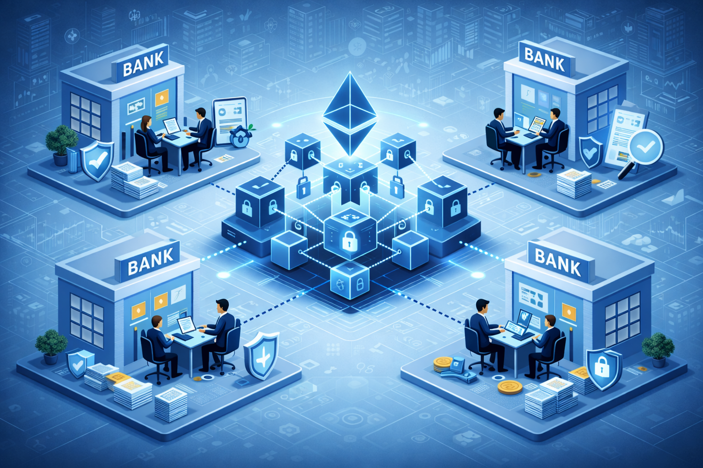
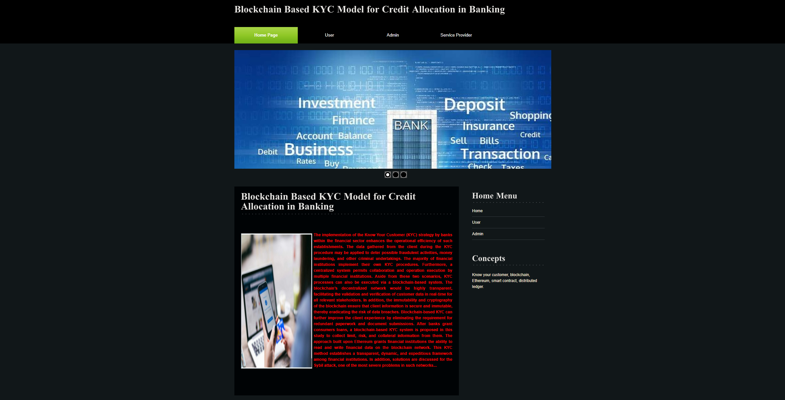
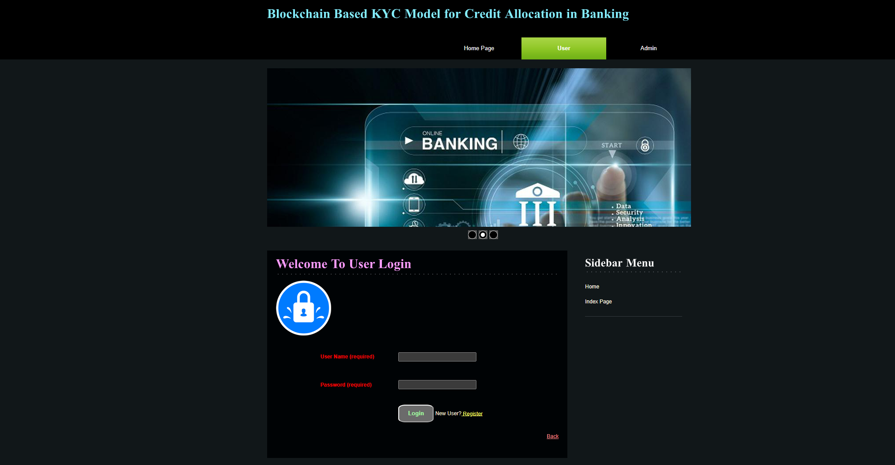
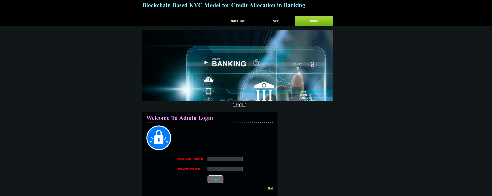
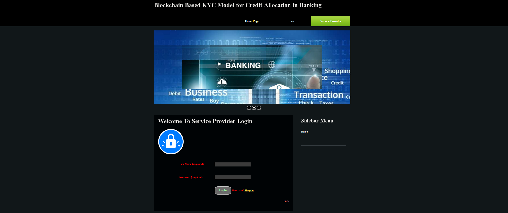

  

# 🔗 Blockchain-Based KYC Model for Credit Allocation in Banking

---

## 📌 Project Overview

This project presents a **Blockchain-Based KYC Model** designed to improve the process of **credit allocation in banking systems**. Traditional KYC systems are centralized and require every bank to perform verification independently. This results in duplication of work, increased operational costs, slower processing times, and higher risks of fraud.

The proposed system uses **blockchain concepts** to create a **shared and secure environment** where banks can access verified customer KYC information without repeating the verification process.

Once a customer's KYC information is verified and recorded, it can be securely accessed by other authorized banks in the network.

---

## 🎯 Objectives

- Improve KYC verification efficiency
- Reduce duplication of KYC processes
- Enable secure data sharing between banks
- Increase transparency in financial transactions
- Reduce fraud and identity theft
- Speed up loan approval processes

---

## ⚙️ Technologies Used

### Frontend
- HTML
- CSS
- JavaScript
- JSP

### Backend
- Java Servlets

### Database
- MySQL

### Server
- Apache Tomcat

### Concepts
- Blockchain
- Distributed Ledger
- Smart Contract Concept (Simulation)
- Secure Data Sharing

---

## 🧩 System Modules

### 👨‍💼 Admin Module
- Manage users and banks
- Authorize KYC verification
- View system datasets
- Monitor blockchain-based records

### 👤 User Module
- Register in the system
- Upload KYC information
- View verification status
- Manage personal profile

### 🏦 Bank / Service Provider Module
- Register bank accounts
- Upload customer financial datasets
- Access blockchain verified records
- Evaluate credit risk

---

## 🏗️ Project Architecture
                +-------------------+
                |       User        |
                | Upload KYC Data   |
                +---------+---------+
                          |
                          v
                +-------------------+
                |       Admin       |
                | KYC Verification  |
                +---------+---------+
                          |
                          v
                +-------------------+
                | Blockchain System |
                | Secure Data Store |
                +---------+---------+
                          |
                          v
                +-------------------+
                |       Banks       |
                | Access KYC Data   |
                | Credit Evaluation |
                +-------------------+
### Architecture Explanation

1. User uploads KYC information.
2. Admin verifies the KYC details.
3. Verified data is stored in blockchain.
4. Banks access the verified data for credit evaluation.

## 🔄 System Workflow

1️⃣ User registers in the system  
2️⃣ User uploads KYC details  
3️⃣ Admin verifies and authorizes user  
4️⃣ Bank uploads loan datasets  
5️⃣ Data stored in blockchain simulation  
6️⃣ Other banks access verified information  
7️⃣ Loan approval decisions are made

---

## 🚀 Advantages

- Faster KYC verification
- Reduced operational costs
- Improved fraud detection
- Transparent data sharing
- Secure financial data management

---

## ⚡ Installation and Setup

Follow these steps to run the project locally.

1. Install **Java JDK**
2. Install **Apache Tomcat Server**
3. Install **MySQL Database**
4. Import the project into **Eclipse IDE**
5. Configure the database connection in the project
6. Run the project using **Tomcat Server**

After running the project, open the browser and navigate to:

http://localhost:8080/BlockchainKYC

Ensure that MySQL server is running before starting the application.

## 🗄️ Database Configuration

Database used in this project is **MySQL**.

Steps:

1. Open MySQL
2. Create a database

CREATE DATABASE blockchain_kyc;

3. Import the provided SQL file located in the project folder:

Database/Database.sql
Tables include:

- Users
- KYC_Data
- Datasets
- Bank_Records

## 📷 System Screenshots

### Home Page

### User Login

### Admin Login

### Service Provider Login

## 🔮 Future Enhancements

- Integration with real Ethereum blockchain
- Solidity smart contract implementation
- AI-based fraud detection
- Secure digital identity verification

---

## 📚 Conclusion

The Blockchain-Based KYC Model improves banking KYC systems by enabling secure, decentralized, and transparent data sharing. The system demonstrates how blockchain technology can improve efficiency, reduce redundancy, and strengthen trust among financial institutions.

---

⭐ Developed as a **Final Year B.Tech Project**
